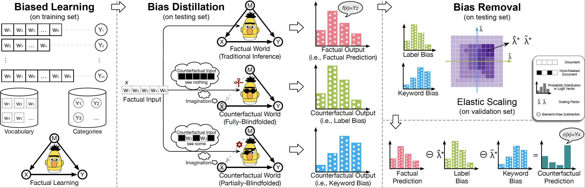

# Corsair

This the the repository for the ACL-2021 paper [***Counterfactual Inference for Text Classification Debiasing***](https://aclanthology.org/2021.acl-long.422/).

By leveraging the causal intervention, we propose a model-agnostic text classification debiasing framework – CORSAIR, which can effectively avoid employing data manipulations or designing balancing mechanisms.



## Overview

- code/ 
  contains the source codes.
- data/ 
  contains eleven datasets used for evaluating.

### Reqirements:

* Python (≥3.0)
* PyTorch (≥1.0)
* All hyperparameters are in _public.py.


### Citation

If you find this study helpful or related, please kindly consider citing as:

```
@inproceedings{Corsair,
  title = {Counterfactual Inference for Text Classification Debiasing},
  author = {Chen Qian and Fuli Feng and Lijie Wen and Chunping Ma and Pengjun Xie},
  booktitle = {Proceedings of the Joint Conference of the 59th Annual Meeting of the Association for Computational Linguistics and the 11th International Joint Conference on Natural Language Processing (ACL-IJCNLP 2021)},
  year = {2021},
  pages = {5434–5445}
}
```
